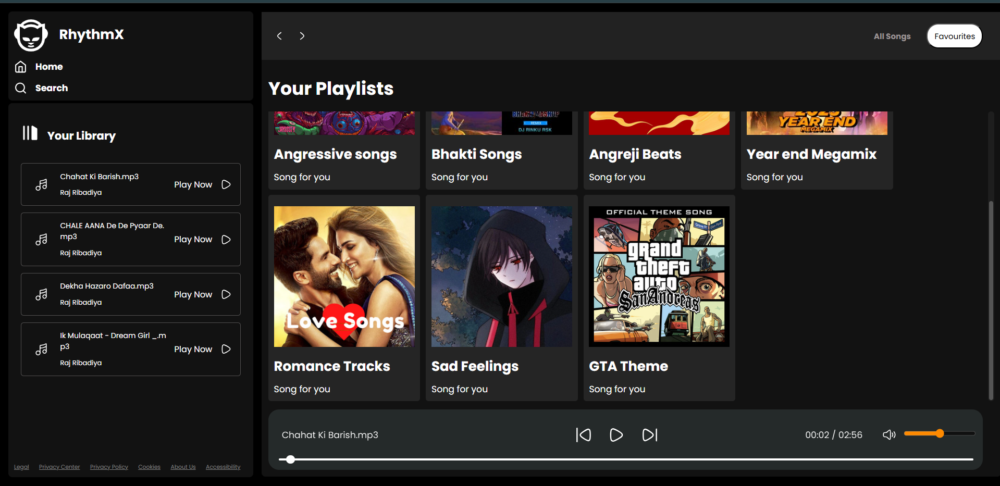

# 🎵 RhythmX - Personal Web Music Player


A simple and sleek personal web music player built using **HTML**, **CSS**, and **JavaScript**. Play your favorite songs with an intuitive interface and smooth animations.

## 🌟 Features

- 🎶 Play, pause, and skip tracks  
- 🔁 Loop and shuffle options  
- 🎧 Display current song info and progress  
- 🎨 Responsive and modern UI  
- 📂 Uses a JSON file to load songs dynamically  
- 🔒 `.htaccess` file for folder access control (if deployed on Apache server)

## 🛠 Tech Stack

- **Frontend:** HTML, CSS, JavaScript  
- No backend required — pure client-side app  

## 📦 Installation & Usage

## 1. Clone the repository
```
git clone https://github.com/mr-coder-raj/RhythmX-Personal-webmusic-player_HTML-CSS-JS.git
```
## 2. Navigate into the project directory
```
cd RhythmX-Personal-webmusic-player_HTML-CSS-JS
```
## 3. Open index.html in your browser
### You can simply double-click index.html or run:
## On macOS/Linux:
```
open index.html
```
## On Windows (PowerShell):
```
start index.html
```

>Note:
>The app loads song data dynamically from songs.json. Make sure this file is present and correctly formatted to see your songs listed.
>The .htaccess file is included to control access permissions when hosting on an Apache server.

# 🤝 Contributing
Contributions are welcome! Feel free to fork the repo and submit pull requests for improvements or bug fixes.

# 📄 License
This project is licensed under the MIT License.

Made with ❤️ by @mr-coder-raj

